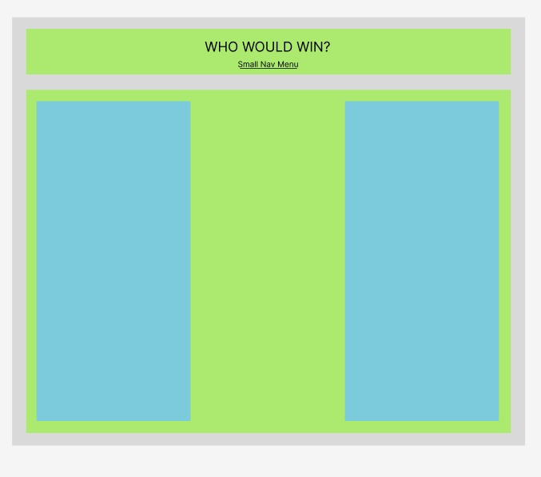

# Who Would Win
Who would win is a website that you can use to finds out who is the strongest hero or villian in the universe! 

A simple to use front end React.js app using functional components.

# Personal Aim
I wanted to have a focus on CSS.

# Usecase
-Your younger siblings or kids are arguing non stop over who is the strongest, Wolverine or Batman? Spiderman or Thanos? Well now you can have your answer.

Simply select two fighters and make them fight to see who the winner is!

## :computer: [Click here](https://whowouldwin.surge.sh/) to see my live project!

## :speech_balloon: About
- Users can choose any fighter they want and see who is strongest
- The website shows you the stats for that fighter

## :memo: Planning:
## Sketchs for the initial idea:
- There are the sketchs used to start the project.

1) Clarified the idea and used figma to create some mockups
2) Map out workflow and divided task into trello actions
3) Aimed for MVP done by Wed. night so I would have time to work on CSS.
4) After getting to MVP I was able to start working on the design of my site.

## :rocket: Cool tech
- HTML
- Javascript
- React.js
- Animations with CSS3
- Trello

## :scream: Bugs to fix :poop:
- Make mobile responsive
- Break it down into more components.
- Improved error handling
- Tweak algorithim 

## :sob: Lessons learnt
- Leave time to read the documentation
- Planning early helped me to get started, and helped when I got stuck.
- Push to git often
- Working with API's and getting data from large and nested objects.
- How to work with React functional components 
- Use a CSS Framework

## :National Park: Future features
- Reset only one fighter at a time not whole page.
- Crate a database of searachable stats
- Create fighters as a card with stats and data on the back